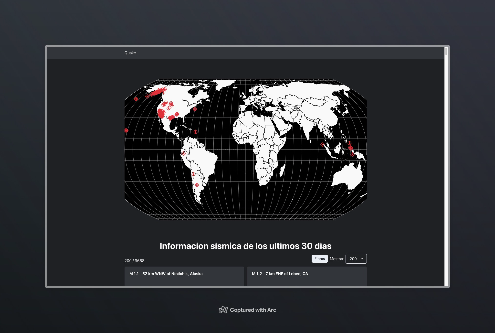

# React on Rails ⚛️🔺🐳

> [React On Rails](https://github.com/olaracode/react-on-rails)

Basic setup for a React app with Rails backend using docker-compose.

## Quake

Indice:

- [Quake](#quake)
  - [Features](#features)
  - [Setup](#setup)
  - [Postman](#postman)

Quake es una aplicación fullstack que muestra los sismos ocurridos en el último mes en todo el mundo.

> Data obtenida de: [earthquake.gov](https://www.usgs.gov/programs/earthquake-hazards)

> Endpoint usado: [/earthquakes/feed/v1.0/summary/all_month.geojson]('https://earthquake.usgs.gov/earthquakes/feed/v1.0/summary/all_month.geojson')



### Features

- [x] Rails 7
- [x] React 18

###

### Setup

1. Clone the repository

```bash
git clone https://github.com/olaracode/quake.git
```

2. Start containers

```bash
docker compose up --build
```

3. Load fixtures

Para empezar a usar la api debes cargar los datos de los sismos ocurridos en el último mes. Para ello usamos la task `sismologia:obtener_datos`

**3.1 Levantar una consola en el contenedor de la api**

```bash
docker compose exec server bash
```

**3.2 Ejecutar la task**

```bash
rake sismologia:obtener_datos
```

4. Open the app

```bash
open http://localhost:3000 # Backend
open http://localhost:5137 # Frontend
```

### Postman

Si usas postman puedes importar la colección de requests que se encuentra en el archivo [Quake.postman_collection.json#](./docs/Quake.postman_collection.json)
